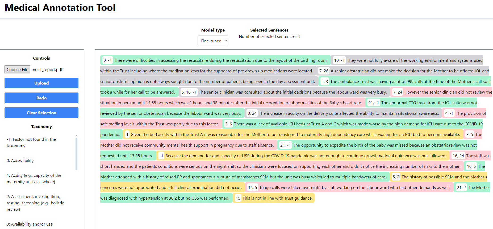

# Medical Annotation Tool

### Notice

This repository does not contain the model or the data the model was trained as the data is sensitive.

## Introduction

This annotation tool is intended to allow medical professionals to annotate investigation reports using the SIRch taxonomy.



## Pre-requisites

#### HuggingFace API Token

A HuggingFace API token is required for fine-tuning the model.

The token can be obtained by:

1. Signing up to HuggingFace [here](https://huggingface.co/join)
2. Generating a new API token [here](https://huggingface.co/settings/tokens).

#### WSL (Windows Subsystem for Linux)

At the time of writing, Ollama is not supported on Windows. As such, WSL for Windows is required to run the backend on Windows.

To install WSL, follow the instructions [here](https://docs.microsoft.com/en-us/windows/wsl/install), then proceed to install the backend as per the instructions below in the WSL terminal.

## Installation

### Backend

To install the required packages, run the following command:

```bash
cd backend
conda create -n medical-annotation-tool python=3.11
conda activate medical-annotation-tool
pip install -r requirements.txt
```

Create a `.env` file in the `backend` directory with the following content:

```bash
HUGGINGFACE_TOKEN=YOUR_HUGGINGFACE_TOKEN
```

Install Ollama by running the command:

```bash
curl -fsSL https://ollama.com/install.sh | sh
```

Install Mistral 7B by running the command:

```bash
ollama install mistral-7b
ollama list
```

Then run the following command to start the backend:

```bash
python main.py
```

### Frontend

Node.js is required to run the frontend. It can be downloaded from [here](https://nodejs.org/en/download/).

To install the required packages, run the following command:

```bash
cd frontend
npm install
```

Then run the following command to start the frontend:

```bash
npm start
```

### Notebooks

This directory contains the notebooks used to quickly test and evaluate the model using different prompting techniques, hyper-parameters, and datasets.

To install the required packages, run the following command:

```bash
cd notebooks
conda create -n notebooks python=3.11
conda activate notebooks
pip install -r requirements.txt
```

Then run the following command to start the Jupyter notebook server:

```bash
jupyter notebook
```

## Usage

The frontend can be accessed at:

```bash
http://localhost:3000
```

The backend API for annotation can be accessed at:

```bash
http://localhost:5000/annotate
```
